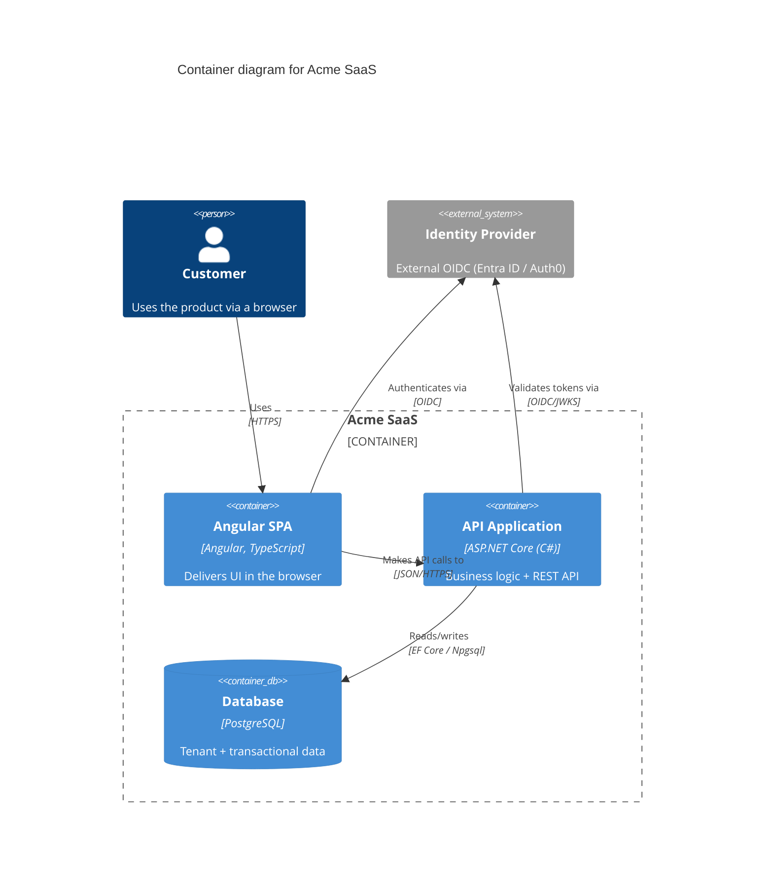

# C4 model views

Maps of the system at four zoom levels - Context -> Container -> Component -> Code -
abstraction-first and notation-independent. A **container** is a separately deployable/runnable
unit (an app, a data store - NOT a Docker container, though they can coincide); a **component**
is related functionality behind a well-defined interface (in C#, roughly classes behind an
interface). C4 complements UML/ER/sequence diagrams and ADRs, it does not replace them: diagrams
show the OUTCOME of decisions, the rationale lives in the ADRs (`references/adr.md`).

In this house the committed architecture map (`project-architecture-analyzer`'s
ARCHITECTURE.md - flowchart + module table) is the primary structure doc and sits at roughly
container/component altitude. Draw C4 views to SUPPLEMENT it - a stakeholder-facing context
view, a multi-system landscape - never as a rival copy of the map.

## The levels - where the value is

- **L1 Context**: the system as one box, the people who use it, the external systems it touches.
  Audience includes non-technical stakeholders. No internal technology detail at all. (Many
  interconnected systems? Start with a System Landscape view instead.)
- **L2 Container**: THE most useful level - often the only diagram a project needs. The
  deployable/runnable parts inside the boundary, their technology, how they communicate, plus
  directly-connected people and external systems. No deployment/clustering/load-balancer detail
  here - that varies per environment and belongs in a Deployment view. Don't duplicate what is
  better generated: endpoints -> OpenAPI, schema -> ER; link them.
- **L3 Component**: inside ONE container - only for containers whose internals are non-obvious
  or high-risk. Component diagrams for everything is the classic mistake; they drift fastest.
- **L4 Code**: skip it, or generate from the IDE - never hand-maintain.

Supplementary: **Dynamic** (one runtime flow - or just use a Mermaid sequence diagram),
**Deployment** (containers onto infrastructure, ONE per environment - this is where load
balancers, replicas, and failover live).

## Notation rules (notation is free, ambiguity is not)

- Every diagram: a title (type + scope) and a legend for shapes/colors/line styles.
- Every element: name + element type + technology + description ('API Application / Container /
  ASP.NET Core / business logic + REST API'). Dropping the metadata reintroduces the ambiguity
  C4 exists to remove.
- Every arrow: directed and labeled with intent + protocol ('Makes API calls to / JSON over
  HTTPS').
- Consistent color/shape across diagrams; survives black-and-white and color-blindness.

## Tooling

- **Structurizr DSL** - the reference tool: define the model ONCE (people, systems, containers,
  relationships), generate many views; solves the drift/duplication of hand-drawn C4. Runs
  locally via the structurizr/lite Docker image; has a .NET port; can attach ADRs to elements.
- **Mermaid C4** (`C4Context`, `C4Container`, ...) - explicitly experimental: manual layout
  (statement order = position), fixed styling, syntax may change. Fine for a quick in-repo
  sketch that renders on GitHub; wrong for a large canonical model.
- C4-PlantUML is the mature middle ground if PlantUML is already in play. Avoid WYSIWYG drawing
  tools for architecture - no model, guaranteed drift.

## Canonical example - Mermaid C4 container sketch (the house stack)

## Common mistakes

- Mixing abstraction levels in one diagram (containers + components together).
- Technical detail in the Context view; deployment detail in the Container view.
- Component diagrams for every container; hand-maintained Code diagrams.
- 'Container' read as Docker; a message broker drawn as one box instead of its topics/queues.
- Treating the four levels as a design PROCESS - they are a communication hierarchy.

## Checklist

- Context + Container first - those two carry nearly all the value.
- Name + type + technology + description on every element; title + legend on every diagram.
- Arrows directed and labeled with intent + protocol.
- Deployment detail only in per-environment Deployment views.
- Rationale in ADRs, structure here; the committed house map stays the primary structure doc.
- Big canonical model -> Structurizr DSL; quick in-repo sketch -> Mermaid C4 (experimental).
