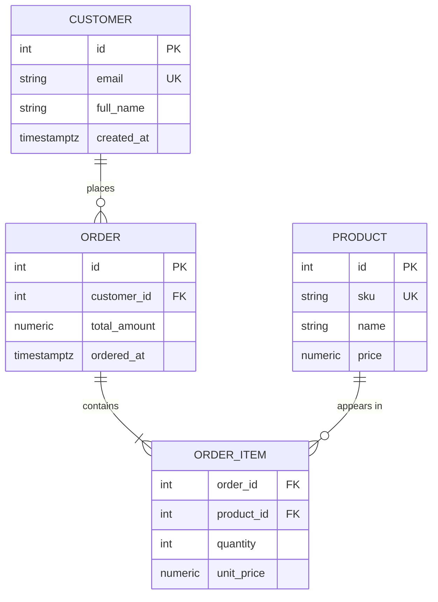

# Mermaid ER diagrams

A conceptual/logical schema sketch - a handful of tables, keys, and cardinality - embedded where
the reader is (a README, a design doc). It is hand-maintained documentation, NOT the physical
schema's source of truth: for a .NET project that truth is the EF Core model + migrations; for
SQL-first work the DDL. Generate the diagram from the live schema (SchemaCrawler emits Mermaid
from PostgreSQL/SQL Server; EF's model is scriptable) and regenerate in CI, rather than
hand-editing it into drift.

## Notation - crow's foot

A relationship is `ENTITY1 <cardinality>--<cardinality> ENTITY2 : label`. The label is REQUIRED -
omitting it is a parse error. Read it left to right: 'CUSTOMER places ORDER'.

Cardinality (two characters per side - outer = max, inner = min):

| Marker | Meaning |
|---|---|
| `\|\|` | exactly one |
| `o\|` | zero or one |
| `\|{` | one or many |
| `o{` | zero or many |

Common pairs: one-to-one `||--||`, one-to-many `||--o{`, many-to-one `}o--||`.

**Identifying vs non-identifying**: `--` (solid) = identifying, the child cannot exist without
the parent (an ORDER_ITEM without an ORDER is meaningless); `..` (dashed) = non-identifying, both
exist independently (a PRODUCT exists with no orders).

## Attributes and keys

Inside `{ }` as `type name [key] ["comment"]`. Keys: PK, FK, UK. Types are display-only labels -
nothing is enforced. Comments cannot contain quotes. Pick ONE attribute casing (snake_case or
PascalCase) for the whole diagram; entity names conventionally UPPERCASE, singular.

**Many-to-many**: never draw a raw `}o--o{` - make the join table an explicit entity with two
one-to-many identifying relationships, mirroring the real schema.

## Canonical example



(ORDER is quoted - it collides with reserved-word handling in some renderers; quoting is the
safe habit.)

## When to graduate off Mermaid

Mermaid ER has no composite keys, no indexes, no check constraints, no enums, and draws
entity-to-entity lines only (never column-precise FK arrows). The moment the model needs any of
those - or becomes the authoritative physical schema - switch to DBML (dbdiagram.io renders it,
generates CREATE TABLE for PostgreSQL/SQL Server, stays a diffable text file):

```dbml
Table users {
  id integer [primary key]
  email varchar [unique]
}
Table posts {
  id integer [primary key]
  user_id integer
}
Ref: posts.user_id > users.id // many-to-one
```

## Checklist

- Relationship label always present; reads left-to-right.
- PK/FK/UK marked explicitly; one attribute casing throughout.
- Join entity instead of raw many-to-many; `--` identifying vs `..` non-identifying deliberate.
- Generated from the live schema where drift matters; Mermaid ER never the source of truth.
- Needs composite keys / indexes / column-level arrows -> DBML, not a bigger Mermaid diagram.
