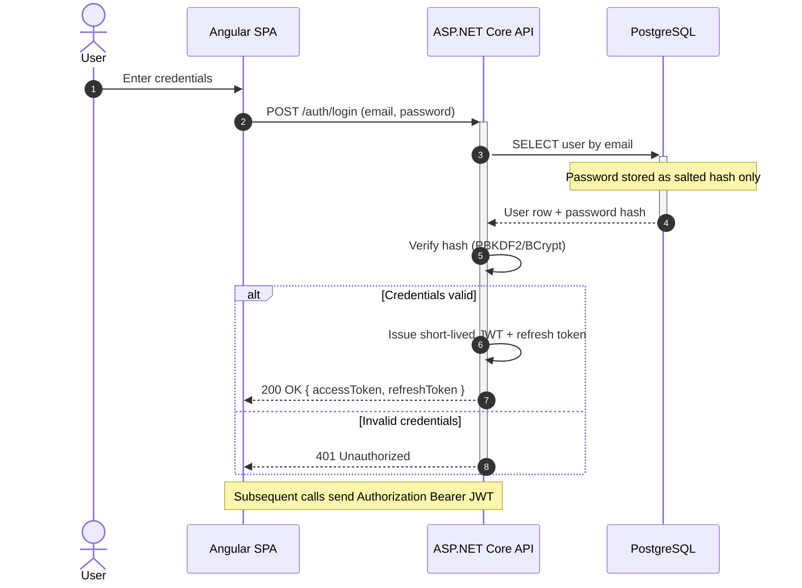

# Mermaid sequence diagrams

Model interactions ordered in time between a small number of participants: API request flows,
auth handshakes, message/event choreography, retry and timeout logic. Not for static structure
(ER/C4) and not for branching business logic (a flowchart reads better).

## Participants

- Declare participants explicitly at the top - they render in order of first appearance, so the
  declaration IS the layout. Alias long names: `participant API as ASP.NET Core API`, then use
  the short id in messages.
- `participant` renders a box (systems); `actor` renders a stick figure (humans, external
  initiators).
- Ids short and code-like (SPA, API, DB, IdP); display labels human-readable and
  technology-tagged (Angular SPA, ASP.NET Core API, PostgreSQL).

## Arrows

| Arrow | Meaning |
|---|---|
| `->>` | synchronous call / request (solid, arrowhead) |
| `-->>` | return / response (dashed, arrowhead) |
| `-)` | async message, fire-and-forget (open arrowhead) |
| `-x` / `--x` | lost/failed message or termination (cross) |
| `->` / `-->` | plain line, no arrowhead (rarely needed) |

## Structure

- **Activations** - show active processing with the shorthand: `+` on the call activates the
  target, `-` on the return deactivates (`API->>+DB: query` ... `DB-->>-API: rows`). Balance
  every `+` with a `-`.
- **Notes** - `Note right of X:`, `Note left of X:`, `Note over X:`, spanning `Note over X,Y:`.
  Use notes to summarize collapsed detail instead of drawing every hop.
- **Fragments** - `loop`, `alt`/`else` (exclusive branches), `opt` (one optional path), `par`/
  `and` (parallel), `critical`/`option` (must-happen with fallbacks), `break` (early exit, e.g.
  on error). Each closes with `end`. They nest - keep nesting at 2 levels max.
- **autonumber** - add it right after the `sequenceDiagram` line for step-numbered walkthroughs
  the prose can reference; it renumbers on insert.
- **Highlighting** - `rect rgb(200,220,255) ... end` for a background region (a transaction
  boundary); `box <color> <label> ... end` groups participants (internal services). rgb() only,
  never hex, in both.

## Size discipline

- Cap lifelines at ~6-8 - beyond that, split into focused diagrams.
- One abstraction level per diagram: client -> API -> DB, OR internal components - never both.
- One happy-path diagram; error and edge cases get their own separate diagrams.

## Canonical example - auth flow (the house stack)

## Checklist

- Participants declared up front - order and aliases deliberate.
- actor for humans, participant for systems; technology in the labels.
- `->>`/`-->>` sync request/response, `-)` async; activations balanced.
- alt/opt/par/critical/break for control flow, nesting <= 2.
- autonumber on referenced walkthroughs.
- Not more than ~8 lifelines; one abstraction level; happy path separated from error paths.
- rgb() not hex in rect/box.
